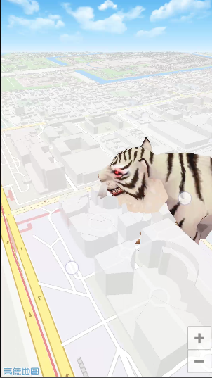

Android_Map_Game
===============
本工程主要介绍了 高德地图Android SDK 3D版本 在基于地图的游戏方面的应用。

##前述：

- [高德官方网站申请key](http://id.amap.com/?ref=http%3A%2F%2Fapi.amap.com%2Fkey%2F).
- 阅读[参考手册](http://a.amap.com/lbs/static/unzip/Android_Map_Doc/index.html).
- 如果有任何疑问也可以发问题到[官方论坛](http://lbsbbs.amap.com/portal.php).

##效果图如下:

* 

##使用方法：

**1.搭建高德地图 AndroidSDK 工程方法见**
[地图SDK使用方法](http://developer.amap.com/api/android-sdk/summary/)

**2.OPENGL接口回调以及缩放比例**

    地图SDK使用OPENGL实现,可通过AMap.setCustomRenderer(CustomRenderer render)获取OPENGL渲染时的回调接口。
    
- 初始化AMap对象及获取OPENGL绘制回调
``` java
     /**
      * 初始化AMap对象
      */
     private void init() {
         if (aMap == null) {
             aMap = mapView.getMap();
    
             //关闭文字
             aMap.showMapText(false);
             //关闭3d楼块
             aMap.showBuildings(false);
             //注1：设置opengl Renderer
             aMap.setCustomRenderer(new MapRenderer(aMap));
         }
     }
```
    
- 地图开放每桢回调及坐标转换

``` java

    class MapRenderer implements CustomRenderer{
        TigerModel tiger;
        AMap aMap;
        ...
        @Override
        public void onDrawFrame(GL10 gl) {
            // 地图开放每帧Render 回调
            // 绘制模型
            tiger.draw();
        }
        
        @Override
        public void OnMapReferencechanged() {
             // 地图放到到一定级别 重新计算缩放比例
             // 开放屏幕、经纬度和OPENGL坐标互转
             aMap.getProjection().fromScreenLocation(screenPos);//屏幕坐标转经纬度
             aMap.getProjection().toScreenLocation(mapLatlng);//经纬度转屏幕坐标
             aMap.getProjection().toOpenGLLocation(mapLatlng);//经纬度转OPENGL坐标
             aMap.getProjection().toOpenGLWidth(screenWidth);//幕宽度转OPENGL宽度
        } 
    }
```


##扫一扫安装

* 
